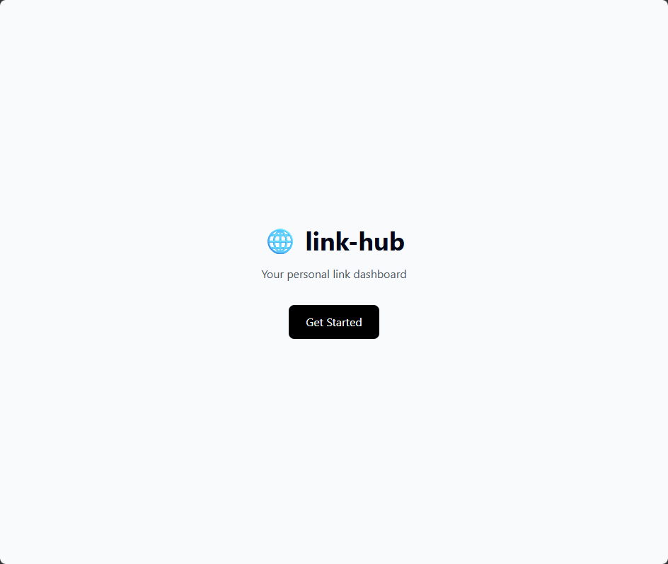

# 🔗 link-hub

A modern, full-stack link management platform that allows users to create, organize, and share their personal link dashboard with the world. Built with Next.js, TypeScript, PostgreSQL, and shadcn/ui.

[](https://link-hub-tan.vercel.app)
[](https://nextjs.org/)
[](https://www.typescriptlang.org/)
[](https://neon.tech/)
[](https://ui.shadcn.com/)
[](https://tailwindcss.com/)
[](https://opensource.org/licenses/MIT)

<br />

## 🚀 Live Demo

**View the live application:** [https://link-hub-tan.vercel.app](https://link-hub-tan.vercel.app)

**Screenshot: Landing Page**



<br />

## ✨ Features

### 🔐 Authentication
- **GitHub OAuth Integration** — Secure and seamless login
- **Session Management** — Persistent sessions with NextAuth.js
- **Protected Routes** — Admin dashboard is gated behind authentication

### 📊 Dashboard
- **Create Links** — Add new links with titles, URLs, and icons
- **Edit Links** — Update existing links with real-time changes
- **Delete Links** — Remove links with a single click
- **Immediate UI Updates** — Changes appear instantly without page refresh

### 👤 Public User Profiles
- **Dynamic Pages** — Each user gets a unique public profile
- **Real-time Click Tracking** — Click counts update instantly
- **Clean Design** — Beautiful, responsive layout

### 🎨 Modern UI with shadcn/ui
- **Accessible Components** — Built on Radix UI primitives for keyboard navigation and screen readers
- **Full Code Ownership** — Components are copied into the project for complete customization
- **Tailwind CSS Native** — Seamless integration with the existing design system
- **Dark Mode Ready** — CSS variables make theming effortless
- **Consistent Design Language** — Buttons, cards, inputs, and labels all share a cohesive style

### 🛠️ Technical Highlights
- **Full-Stack Next.js** — Server Components, API routes, and App Router
- **Type Safety** — Full TypeScript coverage across the entire application
- **Database** — PostgreSQL with Drizzle ORM
- **Performance** — Optimized with React.memo, useCallback, and Suspense
- **Responsive** — Works on all devices (mobile, tablet, desktop)
- **Component Library** — shadcn/ui for accessible, customizable UI components

<br />

## 🛠️ Tech Stack

| Category | Technologies |
|----------|--------------|
| **Frontend** | Next.js 14, React, TypeScript, Tailwind CSS |
| **UI Components** | shadcn/ui, Radix UI, Lucide Icons |
| **Backend** | Next.js API Routes, NextAuth.js |
| **Database** | PostgreSQL (Neon), Drizzle ORM |
| **Styling** | Tailwind CSS v3, tailwind-merge, clsx |
| **Deployment** | Vercel |
| **Package Manager** | npm |

<br />

## 📁 Project Structure
```
link-hub/
├── src/
│ ├── app/
│ │ ├── admin/ # Protected admin dashboard
│ │ │ ├── links/
│ │ │ │ ├── new/ # Create new link
│ │ │ │ └── [id]/edit/ # Edit existing link
│ │ │ └── page.tsx
│ │ ├── api/
│ │ │ └── links/ # CRUD API routes
│ │ ├── auth/
│ │ │ └── signin/ # Login page
│ │ ├── [userId]/ # Dynamic user profiles
│ │ ├── layout.tsx
│ │ └── page.tsx
│ ├── components/
│ │ ├── ui/ # shadcn/ui components
│ │ │ ├── button.tsx
│ │ │ ├── card.tsx
│ │ │ ├── input.tsx
│ │ │ └── label.tsx
│ │ └── ... # Custom components
│ ├── lib/
│ │ ├── db/ # Database schema & connection
│ │ └── utils.ts # shadcn/ui cn() helper
│ └── types/ # TypeScript type definitions
├── drizzle/ # Database migrations
├── public/ # Static assets
├── components.json # shadcn/ui configuration
├── tailwind.config.js # Tailwind config with shadcn theme
└── package.json
```

<br />

## 🚀 Getting Started

### Prerequisites

- [Node.js](https://nodejs.org/) (v18 or higher)
- [npm](https://www.npmjs.com/) or [yarn](https://yarnpkg.com/)
- A [Neon](https://neon.tech) PostgreSQL database
- A [GitHub OAuth App](https://github.com/settings/developers)

### Installation

1. **Clone the repository**
   ```bash
   git clone https://github.com/tolkensak/link-hub.git
   cd link-hub
   ```

2. **Install dependencies**
    ```bash
    npm install
    ```

3. **Set up environment variables**
    Create a `.env.local` file in the root directory:
    ```env
    # Database
    DATABASE_URL="postgresql://..."

    # NextAuth
    NEXTAUTH_SECRET="your-secret-key"
    NEXTAUTH_URL="http://localhost:3000"

    # GitHub OAuth
    GITHUB_ID="your-github-client-id"
    GITHUB_SECRET="your-github-client-secret"
    ```

4. **Set up the database**
    ```bash
    # Generate migrations
    npx drizzle-kit generate

    # Push to database
    npx drizzle-kit push
    ```

5. **Start the development server**
    ```bash
    npm run dev
    ```

**6. Open your browser**
    Navigate to http://localhost:3000

<br />

## 📚 Usage Guide

### Creating a GitHub OAuth App

1. Go to **GitHub Developer Settings**
2. Click **"New OAuth App"**
3. Fill in the details:
    - **Application name:** `link-hub`
    - **Homepage URL:** http://localhost:3000 (development) or your Vercel URL
    - **Authorization callback URL:** http://localhost:3000/api/auth/callback/github

4. Copy the **Client ID** and **Client Secret** to your `.env.local`

### Managing Links

1. **Sign in** with GitHub
2. **Add a link:** Click "Add New Link" → Fill in the details → Submit
3. **Edit a link:** Click "Edit" on any link → Update → Save
4. **Delete a link:** Click "Delete" → Confirm

### Your Public Profile

- Your profile is available at: https://link-hub-tan.vercel.app/[your-user-id]
- Share this link with anyone to showcase your links
- Click tracking is automatic — each click increments the counter

<br />

## 🎨 UI Components (shadcn/ui)
This project uses shadcn/ui — a collection of beautifully designed, accessible components built on Radix UI and Tailwind CSS.

### Why shadcn/ui?

Unlike traditional component libraries, shadcn/ui copies the component code directly into your project. This means:

- ✅ Full ownership — You can customize every component
- ✅ No version lock-in — No forced upgrades
- ✅ Accessibility built-in — Radix UI primitives are keyboard-navigable and screen-reader friendly
- ✅ Tailwind native — Perfect fit with the existing design system

### Available Components
| Component	| Usage |
| - | - |
| Button	| Primary actions, forms, CTAs |
| Card	| Container for grouped content |
| Input	| Form text inputs |
| Label	| Accessible form labels |

### Adding More Components

```bash
npx shadcn@latest add [component-name]

# Examples:
npx shadcn@latest add dialog
npx shadcn@latest add popover
npx shadcn@latest add avatar
npx shadcn@latest add badge
```

<br />

## 🧪 Testing

```bash
# Run tests
npm run test

# Run tests with UI
npm run test -- --ui

# Generate coverage report
npm run test -- --coverage
```

<br />

## 📦 Deployment

The easiest way to deploy is with Vercel:

1. **Push your code to GitHub**
2. **Import your repository** on [Vercel](https://vercel.com)
3. **Add environment variables** (same as `.env.local`)
4. **Deploy** — Vercel will automatically build and deploy your app

<br />

## 🤝 Contributing

Contributions are welcome! Here's how:

1. Fork the repository
2. Create a feature branch: `git checkout -b feature/amazing-feature`
3. Commit your changes: `git commit -m 'Add amazing feature'`
4. Push to the branch: `git push origin feature/amazing-feature`
5. Open a Pull Request

<br />

## 📄 License

This project is licensed under the MIT License — see the [LICENSE](LICENSE) file for details.

<br />

## 🙏 Acknowledgments

- Next.js — The React framework for production
- Neon — Serverless Postgres
- Drizzle — Type-safe SQL ORM
- NextAuth.js — Authentication for Next.js
- shadcn/ui — Beautiful, accessible UI components
- Radix UI — Accessible UI primitives
- Tailwind CSS — Utility-first CSS framework

<br />

## 🔗 Links

- **Live Demo:** https://link-hub-tan.vercel.app
- **GitHub Repository:** https://github.com/tolkensak/link-hub
- **GitHub Portfolio:** https://tolkensak.github.io/tolkensak
- **LinkedIn:** https://www.linkedin.com/in/tolkyn-akhmetollauly-0a3873a9/

<br />

---

Built with ❤️ by Tolkyn Akhmetollauly
